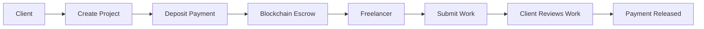
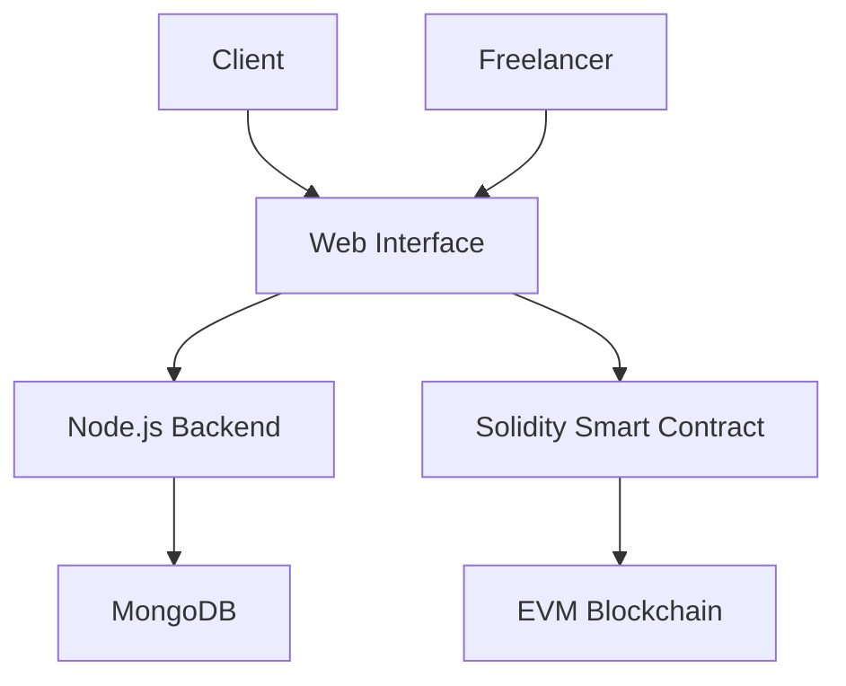
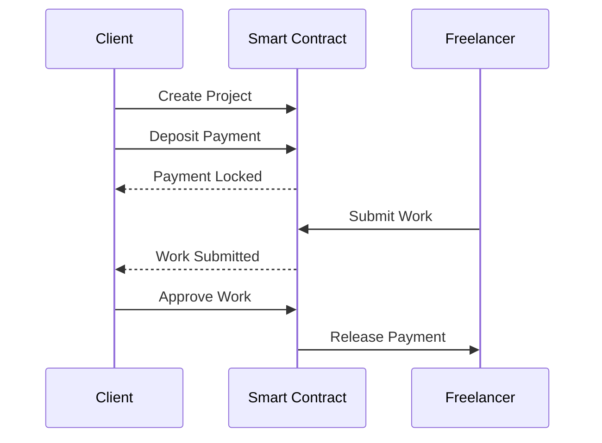
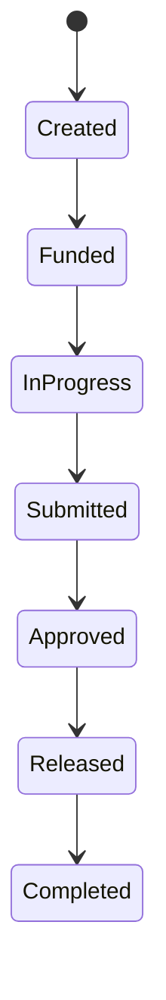

# FreelanceVault

### Blockchain-Based Freelance Escrow Platform

FreelanceVault is a blockchain-based freelance payment platform that uses a smart contract to securely hold and release payments between clients and freelancers.

The main idea is to reduce dependency on traditional payment intermediaries by using blockchain-based escrow.

---

## How It Works



---

## Basic Architecture

The project is divided into three main parts:



### Main Components

**Frontend**

* Simple web interface
* Client and freelancer dashboards
* Project creation and project tracking

**Backend**

* Node.js and Express
* Stores project-related information
* Provides APIs for the frontend

**Blockchain**

* Solidity smart contract
* Handles escrow payments
* Controls payment release and refunds

---

## Escrow Flow



---

## Project Lifecycle



---

## MVP Features

### Client

* Create a freelance project
* Set project payment
* Deposit payment into escrow
* View project status
* Review submitted work
* Approve completed work
* Request refund where applicable

### Freelancer

* View available projects
* View project details
* Submit completed work
* Track project status
* Receive payment after approval

### Smart Contract

The smart contract will handle the important payment operations:

* Create project
* Lock payment
* Submit work
* Approve work
* Release payment
* Refund payment

---

## Technology Stack

| Layer       | Technology                                 |
| ----------- | ------------------------------------------ |
| Frontend    | React, JavaScript/TypeScript, Tailwind CSS |
| Backend     | Node.js, Express                           |
| Database    | MongoDB                                    |
| Blockchain  | Solidity                                   |
| Development | Hardhat                                    |
| Network     | EVM Testnet                                |

The project will initially use a simple frontend and backend architecture.

Advanced Web3 libraries will be added later only if required.

---

## Project Structure

```text
freelance-vault/
│
├── frontend/
│   ├── src/
│   ├── components/
│   ├── pages/
│   └── package.json
│
├── blockchain/
│   ├── contracts/
│   │   └── FreelanceEscrow.sol
│   ├── scripts/
│   ├── test/
│   └── hardhat.config.js
│
├── backend/
│   ├── routes/
│   ├── controllers/
│   ├── models/
│   └── server.js
│
└── README.md
```

---

## Smart Contract

The main smart contract will contain the core escrow operations:

```text
createProject()
depositFunds()
submitWork()
approveWork()
releasePayment()
refundClient()
```

The first version will use testnet assets instead of real money.

---

## System Flow

```mermaid
flowchart TD
    A[User] --> B[Web Interface]

    B --> C{User Type}

    C -->|Client| D[Create Project]
    C -->|Freelancer| E[View Project]

    D --> F[Deposit Payment]
    F --> G[Smart Contract]

    E -->
```
