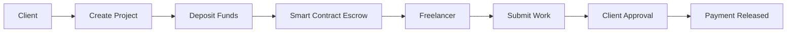
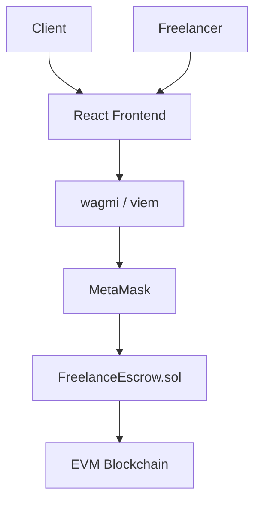
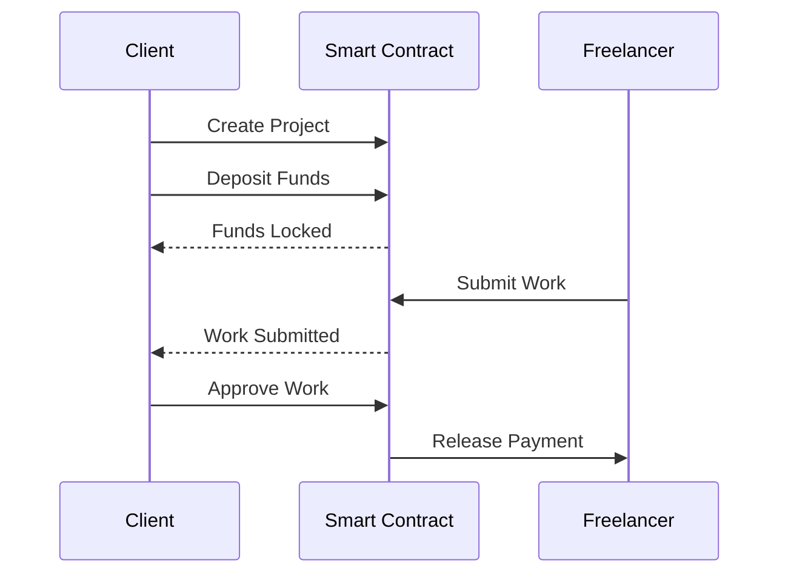
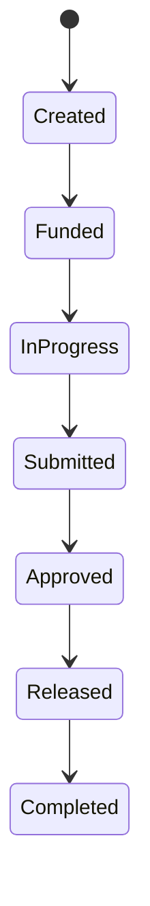
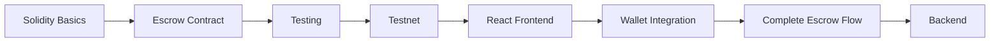
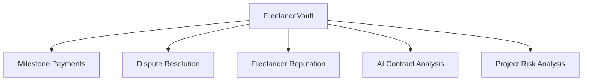

# FreelanceVault

### Blockchain-Based Freelance Escrow Platform

FreelanceVault is a blockchain-based freelance payment platform where smart contracts securely hold and release payments between clients and freelancers.

The project explores how blockchain can reduce reliance on centralized payment intermediaries.

---

## How It Works



---

## Architecture



---

## Escrow Flow



---

## Project Lifecycle



---

## MVP Features

### Client

- Connect wallet
- Create project
- Deposit payment
- Review submitted work
- Approve completed work
- Request refund

### Freelancer

- Connect wallet
- View projects
- View project details
- Submit completed work
- Receive payment

### Smart Contract

- Project creation
- Escrow deposits
- Work submission
- Payment release
- Refund handling

---

## Tech Stack

| Layer | Technology |
|---|---|
| Frontend | React, TypeScript, Tailwind CSS |
| Blockchain | Solidity, Hardhat |
| Web3 | wagmi, viem |
| Wallet | MetaMask |
| Network | EVM Testnet |
| Backend | Node.js, Express, MongoDB |

---

## Project Structure

```text
freelance-vault/
├── frontend/
│   ├── src/
│   ├── package.json
│   └── ...
│
├── blockchain/
│   ├── contracts/
│   │   └── FreelanceEscrow.sol
│   ├── scripts/
│   ├── test/
│   └── hardhat.config.js
│
├── backend/
│   ├── routes/
│   ├── controllers/
│   ├── models/
│   └── server.js
│
└── README.md
```

---

## Smart Contract

The initial smart contract will contain the core escrow functions:

```text
createProject()
depositFunds()
submitWork()
approveWork()
releasePayment()
refundClient()
```

The contract will initially operate using testnet assets.

---

## Roadmap



### Phase 1 — Blockchain

- [ ] Learn Solidity fundamentals
- [ ] Set up Hardhat
- [ ] Build escrow contract
- [ ] Understand contract state

### Phase 2 — Testing

- [ ] Write smart contract tests
- [ ] Test deposits
- [ ] Test payment release
- [ ] Test refund logic
- [ ] Test access control

### Phase 3 — Deployment

- [ ] Deploy locally
- [ ] Deploy to EVM testnet
- [ ] Interact with the contract
- [ ] Understand transactions and gas

### Phase 4 — Frontend

- [ ] Build React interface
- [ ] Create client dashboard
- [ ] Create freelancer dashboard
- [ ] Integrate smart contract

### Phase 5 — Web3

- [ ] Connect MetaMask
- [ ] Configure wagmi
- [ ] Use viem for contract interaction
- [ ] Display transaction status

### Phase 6 — Backend

- [ ] Build Node.js API
- [ ] Add Express
- [ ] Store project metadata
- [ ] Add user profiles
- [ ] Add transaction history

---

## Learning Goals

- Solidity and smart contracts
- Blockchain transactions and gas
- Wallet integration
- Web3 development
- React and blockchain integration
- Smart contract security
- Full-stack Web3 development

---

## Security

This project is being developed for educational purposes.

The initial version:

- Uses testnet assets
- Does not handle real money
- Is not production-ready
- Requires security auditing before real-world deployment

---

## Current Status

```text
Project Setup          [x]
Architecture           [x]
README                 [x]

Solidity Environment   [ ]
Escrow Contract        [ ]
Contract Tests         [ ]
Local Deployment       [ ]
Testnet Deployment     [ ]
React Frontend         [ ]
Wallet Integration     [ ]
Escrow Interface       [ ]
Backend                [ ]
```

---

## Future Improvements



---

## Disclaimer

This project is for educational purposes and will initially use testnet assets only.

It is not intended for real financial transactions.

---

## Author

**Rajshree Sinha**

B.Tech CSE  
Dayananda Sagar University, Bengaluru
